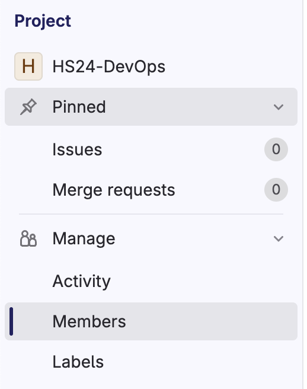
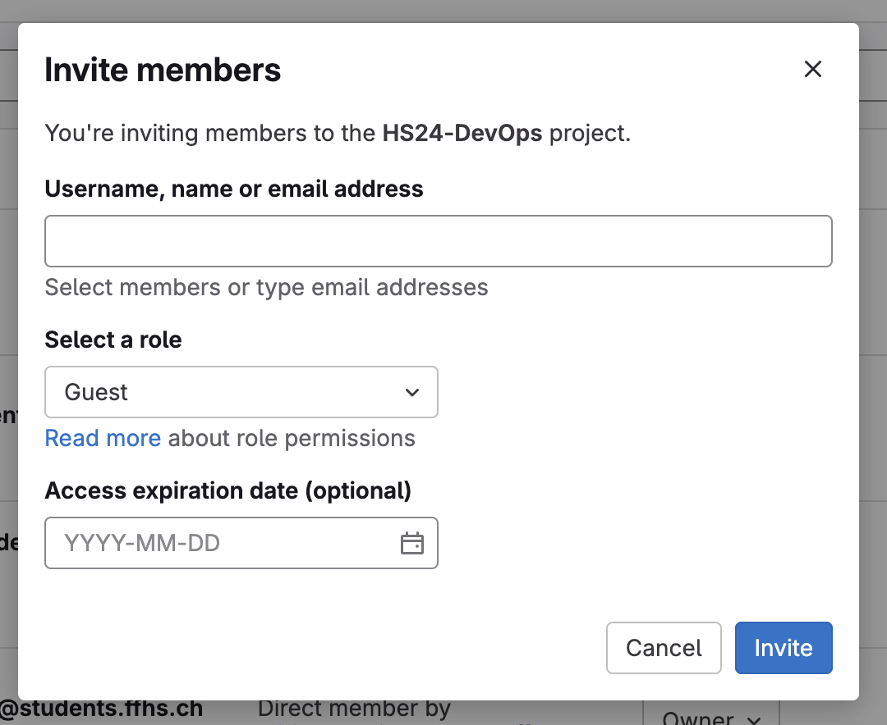

# Adding Users to a GitLab Repository

To add new users to a GitLab repository, follow these steps:

**Project Members**: On the left sidebar, click on "Project information" and then "Members".

**Invite Members**: In the "Invite members" section, enter the username or email of the user you want to add.
> If the user is not already registered on GitLab, you can invite them by email.

**Select Role**: Choose the appropriate role for the user (e.g., Guest, Reporter, Developer, Maintainer, Owner).

**Set Expiry Date (Optional)**: If you want the user's access to be temporary, set an expiry date.

**Add to Project**: Click the "Invite" button to add the user to the project.

The user will receive an email notification and will be able to access the repository based on the assigned role.
