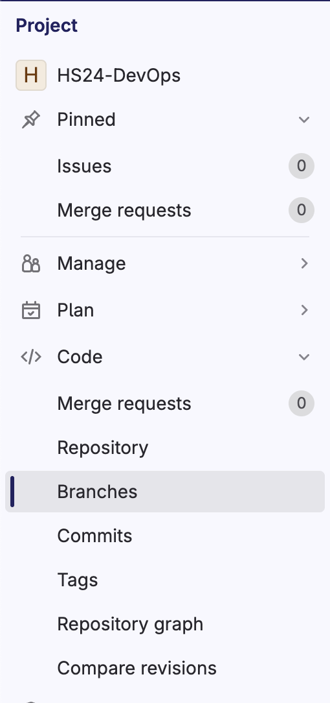
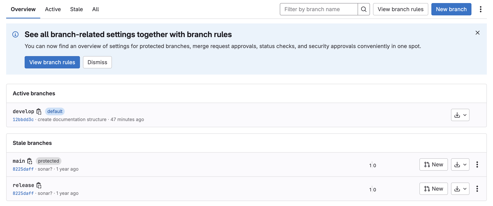
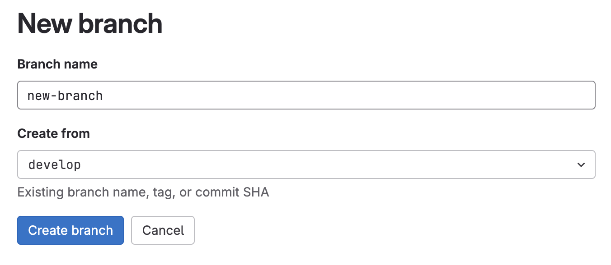

# Creating Branches

Creating branches in GitLab is easy: Just open the sidebar menu and select the setting "Code" and within that "Branches".

An overview of all branches will show:

In the top right corner there is a blue button named "Create branch". Click it and it will lead you to the following view:

Fill out the fields with the name of the new branch and select from the dropdown which branch the new branch should base on.
