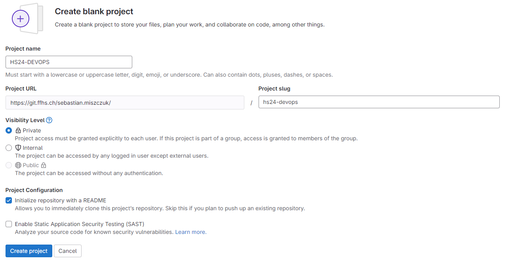

# Creating a new Repository

The following steps allow a GitLab user to create a new project including a repository for the source code.

1. Go to [FFHS GitLab](https://git.ffhs.ch) and log in.
2. Click on "New Project" in the top right corner of the "Projects" tab.
3. Choose "Create blank project", a name and the settings you want to use.
    
    

4. Click the "Create project" button to finish the creation of the project/repository.

## Importing Existing Source Code

There are two main ways of importing existing source code: changin the origin of a local clone and forkin the project.

Since we already had a local clone of the repository we chose to change the origin in the IDE and pushed the commits to the new repository. This allows us to keep all configurations made during the development of the application. 

### Changing the Origin

For this project we will be using an existing application as a baseline. 
To import the source code we used a local clone of another repository and changed it's origin in the IDE. 

After a `git push` we had the source code in our new repository. 
