# Creating the sonar reports

## Prerequisites

> - Sonar Server is installed locally (using brew, for example)
> - sonar-scanner is installed locally (using brew, for example)

## Setting up SonarQube

Access the SonarQube server.

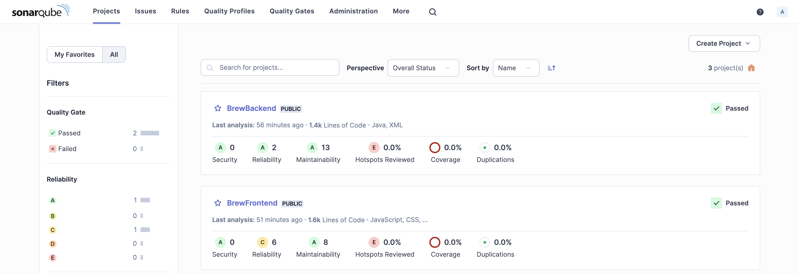

Click the "Create Project" button in the top right corner and select "Local Project".

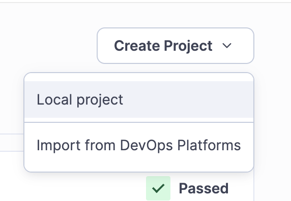

Fill out the form with the name of the project. The branch does not matter as we are scanning locally anyways.

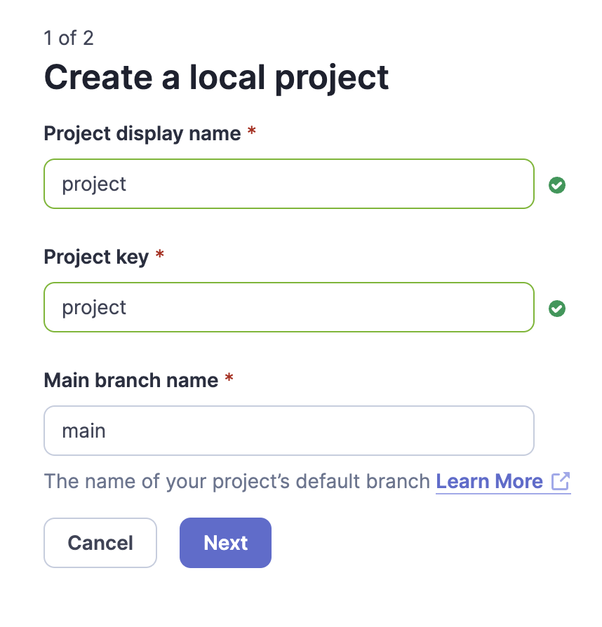

Select the "global settings" option in the next step.

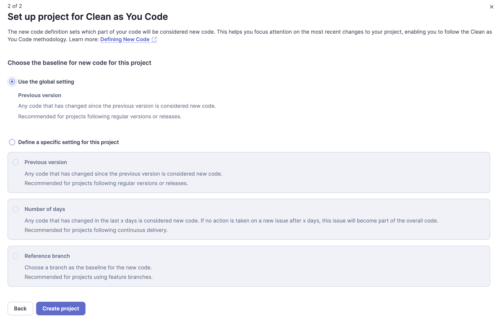

Select the "Locally" analysis method.

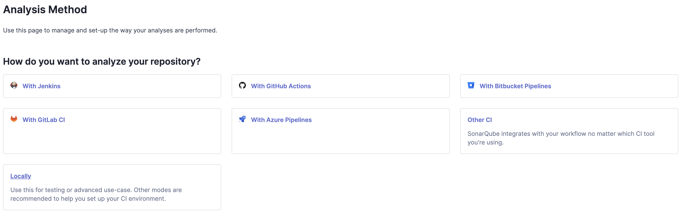

A token is needed to scan a project. We want a new token generated by Sonar. The name for the token is already prefilled and can be left as-is. Press "Generate" to continue.

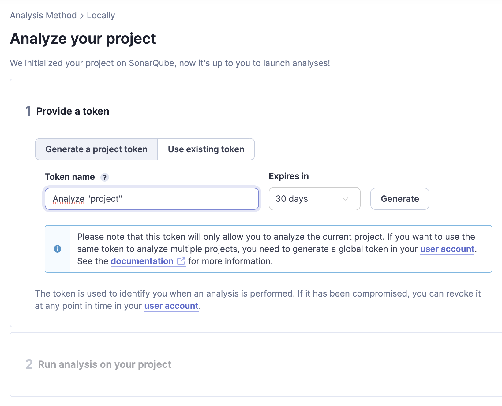

Sonar will now display the token. Copy it and store it safely.

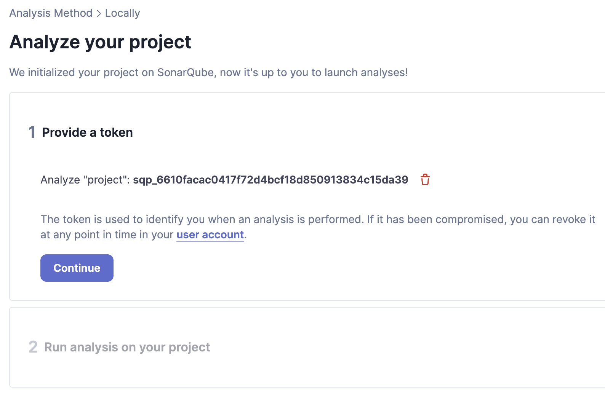

Sonar will now ask what the project setup looks like. We have two projects, so we would need to repeat the above process once. One of our projects is a Maven project which means we can select "Maven" and use the shown command and run it in our project directory without having to make adjustments to the project.

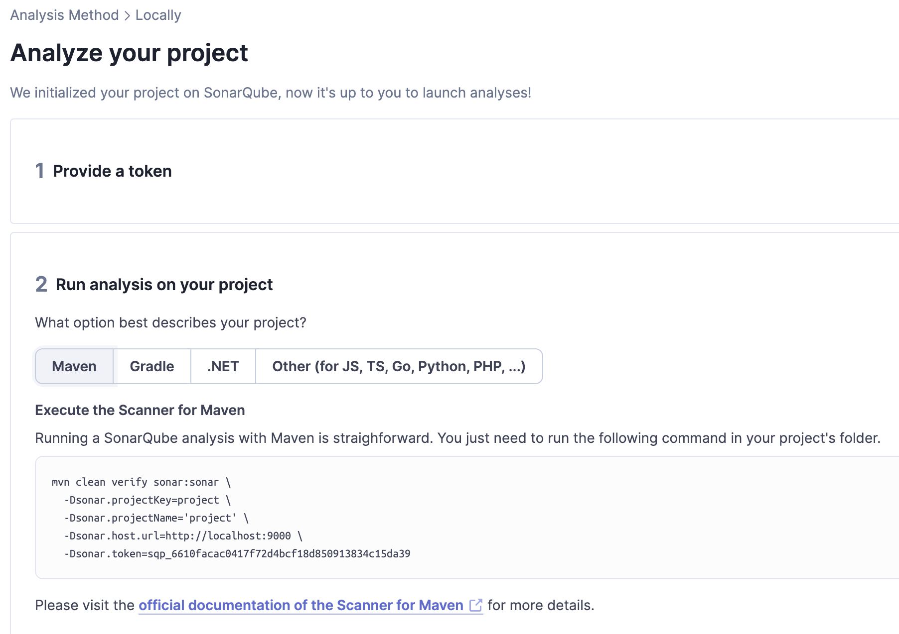

While the backend scan will just work with Maven, our frontend project relies on the `sonar-scanner` being installed locally. Just navigate to the project directory and use the shown command. There's no need to modify the project.

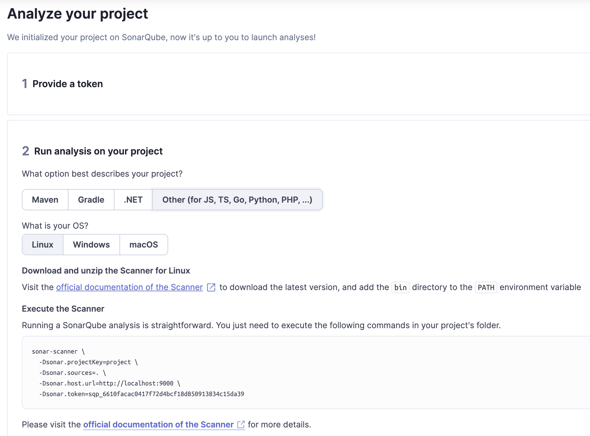

Check Sonar again and navigate to the home page. Both projects should now show up and you can look through the reports (also shown below).

## Reports

### Frontend

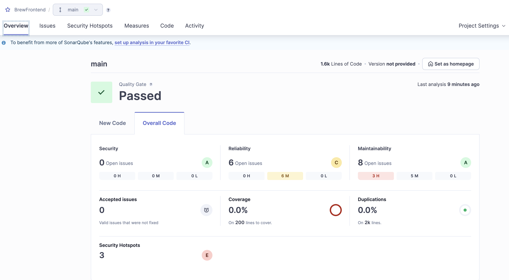

### Backend

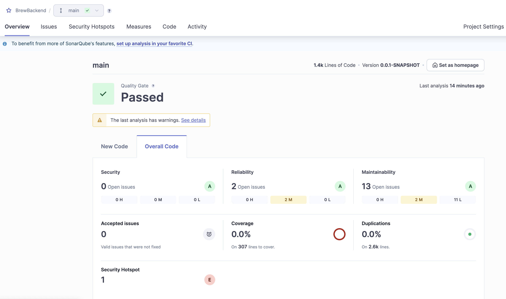

### JSON report

The full report as a JSON file can be found within the folder `sonar-report`. To get the report in this format navigate to http://localhost:9000/api/issues/search.
