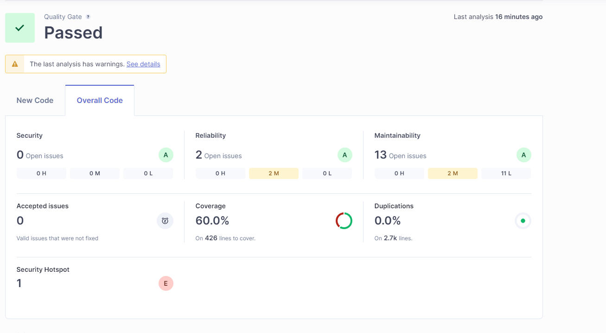

# Sending Unit Test Results to SonarQube

For Java SonarQube recommends using JaCoCo to send test coverage results, so this is what we use for this project.

## Adding JaCoCo Plugin to Maven

To add Unit-Test results to the SonarQube the JaCoCo Plugin has to be used. To add it to the Maven `pom.xml` file the following snippet was used:

```xml
<project>
  ...
  <build>
    <plugins>
      ...
      <plugin>
        <groupId>org.jacoco</groupId>
        <artifactId>jacoco-maven-plugin</artifactId>
        <version>0.8.7</version>
        <executions>
          <execution>
            <id>prepare-agent</id>
            <goals>
              <goal>prepare-agent</goal>
            </goals>
          </execution>
          <execution>
            <id>report</id>
            <goals>
              <goal>report</goal>
            </goals>
            <configuration>
              <formats>
                <format>XML</format>
              </formats>
            </configuration>
          </execution>
        </executions>
      </plugin>
	</plugins>
  </build>
</project>
```

## Generating the Report

To generate the report for SonarQube to use, we extended the "Test" stage to "Test and Generate Coverage Report" by adding the `jacoco:report` goal to the command:

```bash
sh "./mvnw test jacoco:report"
```

Since SonarQube already has checks for the default JaCoCo report file paths we don't need to change anything else to get the test coverage displayed in the SonarQube webUI.




