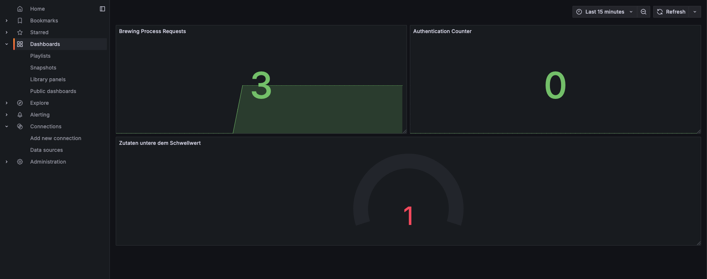

# Showing the exposed metrics in Grafana

## Dependencies

To show the metrics in Grafana, the step "Enriching the existing metrics with our own" from the [Micrometer Spring Boot](/docs/ex-05/micrometer-spring-boot.md) example needs to be completed.

## Grafana Metrics

To show the metrics in Grafana, we need to add a new data source and a new dashboard.

### Data Source

The Data Source should be preconfigured in Grafana. If it is not, do the following to add Prometheus as a Data Source

1. Open the Grafana UI in your browser.
2. Click on the "Connections" icon in the left sidebar.
3. Click on "Add new data source".
4. Select "Prometheus" as the data source.
5. In the "Connection" section, set the URL to `http://prometheus-k8s.monitoring.svc:9090`.
6. Click on "Save & Test".

### Dashboard

1. Open the Grafana UI in your browser.
2. Click on the "Dashboards" icon in the left sidebar.
3. Click on "New".
4. Then on "Add new Dashboard".

#### Add a new panel for the brewing process counter

1. Click on "Add visualization".
2. Select the Data Source you just created.
3. Click on "Queries".
4. Add a new query with the following settings:
   - Query: `brewing_process_creation_request_total`
   - Legend: `Brewing Process Counter`
5. At the right side, go to the top and select "Stat".
6. Click on "Apply".

#### Add a new panel for the authentication counter

1. Click on "Add visualization".
2. Select the Data Source you just created.
3. Click on "Queries".
4. Add a new query with the following settings:
   - Query: `auth_request_total`
   - Legend: `Authentication Counter`
5. At the right side, go to the top and select "Stat".
6. Click on "Apply".

#### Add a new panel for the ingredients threshold gauge
A gauge is a visualization that shows the value of a metric in a range of values. In this case, we want to show the number of ingredients below the threshold per minute.

1. Click on "Add visualization".
2. Select the Data Source you just created.
3. Click on "Queries".
4. Add a new query with the following settings:
   - Query: `ingredients_below_threshold_per_minute`
   - Legend: `Ingredients Threshold Gauge (per minute)`
5. At the right side, go to the top and select "Gauge".
6. At the bottom, set the Threshold to 0, so its color changes when the value is above 1.
6. Click on "Apply".

### Resize the panels

1. In the dashboard, just drag the panels to resize them.

### Result

